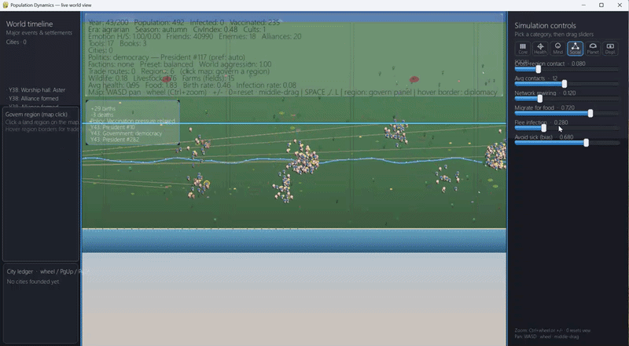

# Dynamic Human Civilization Simulation (Python + Pygame)

This project simulates a human population from early hunter-gatherer origins toward organized civilization, with realtime strategy-style visualization and event-driven world changes.

The model emphasizes **emergent outcomes**: pressure, memory, and resource geography accumulate over time—so wars, alliances, and trade arise from **world state**, not only one-off random rolls.

## Demo



## What The Simulation Includes

### Population and Biology

- Individuals with:
  - age, gender, region
  - health, disease susceptibility
  - inherited genetic traits (`resilience`, `fertility`, `immunity`)
- Life cycle mechanics:
  - aging
  - reproduction (partner matching, fertility constraints)
  - death (natural causes, disease, disaster, war)
- Birth-based growth only (no random NPC spawning during runtime)

### Social, Emotional, and Political Traits

- Per-individual state:
  - `happiness`, `stress`, `aggression`
  - **`ambition`** (drives rivalry, migration appetite, and political weight)
  - `knowledge`, `tool_skill`, `spiritual_tendency`
  - `belief_group`, `faction`, `language`
  - **`political_power`** (compounds with skills, age, and office)
- Communication through **contact networks**
- Relationship graph: **friendships** and **enmities** (formation is gated by trust/conflict margins modulated by **global mood**, not only independent dice)
- Emotions and relationships affect productivity, health trajectory, and fertility outcomes

### World Dynamics (Latent “AI” Layer)

`population_sim/world_dynamics.py` keeps **slow-moving state** that couples regions and years:

- **Global instability**, **collective stress**, **food inequality** (spread of food per capita across regions)
- **Per-border tension** and **trade goodwill** (inertia: pressure builds and releases)
- **Internal war charge** for society-wide scarcity conflicts
- **Belief-group alliance goodwill** (defensive pacts form after sustained calm between groups)

Outcomes are **unpredictable but not meaningless**: the same snapshot rarely guarantees war or peace next year; sustained pressure or a sharp tension spike does.

### Geography, Resources, and Migration

- **Multiple regions** (configurable `region_count`) act as a larger map; migration prefers better food, lower infection, and **regional resource scores**
- Each region’s `Environment` carries **natural resource richness** (water, fertile land, timber, ore) and **territory size**, feeding into food and attractiveness
- **Carrying-capacity-style** food scaling avoids runaway population that would make the sim unusably slow in late years

### Geopolitics: Trade, Diplomacy, and War

- **Trade links** between adjacent regions; food can flow along trade routes (surplus toward deficit)
- **Border wars** and **trade ruptures** emerge from latent border tension and scarcity—not a single yearly coin flip
- **Belief-group alliances** and **resource wars** use accumulation/discharge mechanics where possible

### Civilization and Settlements

- Era progression: hunter-gatherer → agrarian → industrial → modern → information age
- **Per-region settlement** evolution: `camp → village → town → city`
- Agriculture fields and institutions (school, workshop, temple) can appear **per region**
- **City labels** can include **community** and **power style** (e.g. civic-representation, elite-council) and **resource score**
- Large settlements can **split** (secession / civil-war style events) with new regions and settlements

### Disease and Public Health

- Multiple pathogens in parallel
- Disease transmission through the contact graph (with optional GPU-assisted batch sampling; see below)
- Recovery, mortality, immunity loss; pathogen mutation
- Vaccination policy with adaptive responses

### Environment and Disasters

- Food supply with variability, stress, and shocks
- Natural disasters with multi-year consequences (drought, flood, volcanic winter)
- Policy adaptation feeds back into migration, mortality, and fertility

### Events and Timeline

- Event system tied to real conditions and effects
- Timeline and major-event feeds for discoveries, governance, conflict, and disasters
- Realtime timeline panel shows recent major events

### Adaptive Governance (Auto-Adjusting Parameters)

Core parameters can self-adjust from state signals (population, health, infection, food, civilization index), including food policy, birth policy, vaccination, migration, and infection control.

## Performance

- Contact graph and social metrics are optimized for large populations (adaptive contact counts, cached friendship/enemy degrees)
- Optional **GPU path** for disease transmission random sampling: set environment variable `POP_SIM_USE_GPU=1` and install **CuPy** matching your CUDA stack (e.g. `cupy-cuda12x`). If CuPy is missing or fails, the sim falls back to CPU.

## Realtime Strategy View

```bash
python realtime_view.py
```

The window opens **fitted to your primary monitor** (it will not be wider or taller than the usable desktop area). You can **resize** the window by dragging edges; the size stays **clamped** so it stays on-screen.

### Realtime UI Layout

- **Left panel**: world timeline, city ledger, recent events
- **Center world**: regions, terrain, structures, NPCs, social links
- **Right panel**: live sliders for policy/parameter tuning

### Realtime Controls

- `SPACE` pause/resume
- Mouse drag sliders to tune live parameters
- `,` / `.` slower/faster simulation stepping
- `L` toggle labels
- `PgUp` / `PgDn` scroll city ledger
- `F11` toggle **fullscreen** (uses native desktop resolution; press again to return to windowed)
- `ESC` **exit fullscreen** when fullscreen; otherwise **quit** the application

## Batch Simulation

```bash
python main.py
```

Output:

- decadal log in terminal
- major event summary in terminal
- `outputs/population_stats.csv`
- `outputs/population_trends.png`

## Sensitivity Sweep

```bash
python run_sweep.py
```

Output:

- `outputs/sensitivity_sweep.csv`

## Installation

```bash
pip install -r requirements.txt
```

Dependencies:

- `matplotlib`
- `pygame-ce`

## Project Structure

- `main.py`: batch simulation entrypoint + summary logging
- `realtime_view.py`: realtime visualization entrypoint
- `run_sweep.py`: parameter grid/sensitivity runner
- `population_sim/config.py`: configuration dataclasses
- `population_sim/models.py`: individual model + inheritance helpers
- `population_sim/environment.py`: regional resources and food dynamics
- `population_sim/world_dynamics.py`: latent global/border state (tension, trade goodwill, war charge)
- `population_sim/disease.py`: multi-disease transmission (optional GPU batch sampling)
- `population_sim/simulation.py`: core engine, geopolitics, social dynamics, settlements
- `population_sim/stats.py`: metrics, CSV export
- `population_sim/visualize.py`: batch chart rendering
- `population_sim/sweep.py`: sweep automation
- `population_sim/realtime.py`: Pygame renderer and UI

## Key Metrics Tracked

- population, births, deaths
- age and health averages
- disease S/I/R counts, vaccination
- genetic diversity
- region distribution
- civilization index
- knowledge / tool skill / emotional averages
- friendships / enmities

## Notes

- Agents are **rule-based with stateful world dynamics**, not a trained neural policy.
- **Randomness** still appears where a continuous system needs a discrete outcome (e.g. some disease checks), but **large-scale conflict and diplomacy** lean on **accumulated pressure and thresholds** in `world_dynamics.py`.

## Suggested Next Extensions

- Visual **border ownership** and explicit **map tiles**
- **Goods-specific** trade (grain, timber, ore) with prices
- **Dynasties** and named family lines
- **Save/load** and replay
- Richer **peace treaties** and sanctions after wars

## Disclaimer

This project was built with AI assistance and manual engineering decisions: architecture, balancing, edge cases, and UX iteration.
